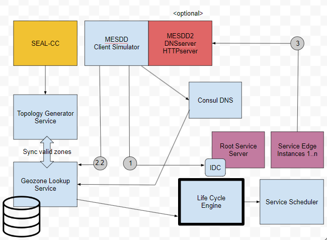

# MESDDclientSimulator

# troubles
set GOPROXY=https://proxy.golang.org,direct 
set GOROOT=C:\Program Files\Go
set GOSUMDB=sum.golang.org

# Docker
https://hub.docker.com/r/kurthorvath/mesdd_simulator

docker run -d -p 8020-8040:8020-8040 kurthorvath/mesdd_simulator

binary found in /APP

# Others
docker run -d --name=dev-consul -p 8500:8500 -v c:\dev\consul\data:/consul/data -v c:\dev\consul\config:/consul/config consul:1.15.4 agent -server -dev -ui -client=0.0.0.0 -bind=0.0.0.0

docker run -d --name=dev-consul1 -p 8500:8500 -p 8600:8600 consul:1.15.4 agent -server -dev -ui -client=0.0.0.0 -bind=0.0.0.0

# consul dev docu
docker run -d -p 8500:8500 -p 8600:8600/udp -p 53:8600 -p 53:8600/udp --name=badger consul:1.15.4 agent -server -ui -node=server-1 -bootstrap-expect=1 -client=0.0.0.0

docker exec badger consul members

docker run --name=fox consul:1.15.4 agent -v /c/work/DNSconfig:/consul/config/ -node=client-1 -retry-join='172.17.0.3'

docker run -p 9001:9001 -d --name=weasel hashicorp/counting-service:0.0.2

docker exec fox /bin/sh -c 'echo '{\'service\': {\'name\': \'counting\', \'tags\': [\'go\'], \'port\': 9001}}' >> /consul/config/counting.json'

docker exec fox consul reload

consul watch -type=service -service=counting /home/consul/myservice.sh
